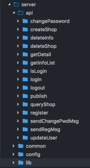
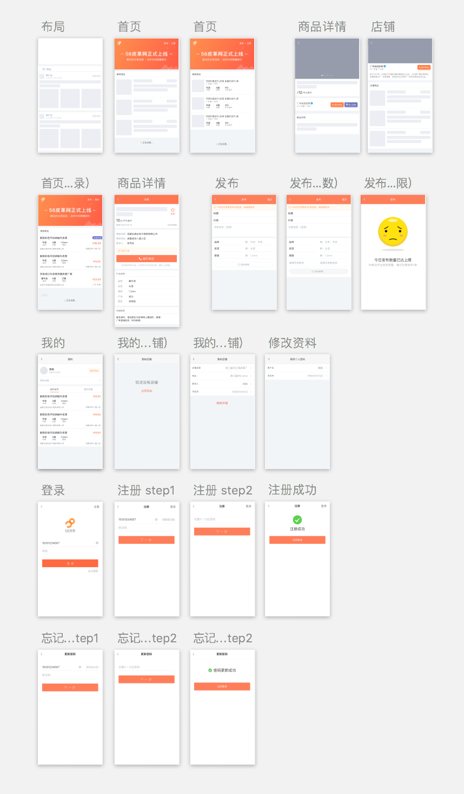

# 58皮革网前端项目 

这是一个基于Vue的垂直分类信息网站，总共十多个组件，功能涉及登录注册、找回密码、信息列表、查看详情、信息发布、修改个人信息、增删店铺。开发阶段基本完成，一段时间后会在 [58pige.com](http://58pige.com) 上线。

P.S. 帮朋友做的试水项目，和58同城没有一毛钱关系。

## 前端

### 技术栈

主要用到了 Vue2 + Vue-Router + axios，处于早期的项目没有太多状态管理的需求（目前就用户登录状态需要全局共享），就用LocalStorage简单地封装了下，所以没有用到Vuex。

> Vuex 就像眼镜：您自会知道什么时候需要它。

开发方面，依然使用Sass、ES6语法、Webpack（vue的CLI）。这次引入ESLint来规范代码非常爽，再也不用纠结4空格缩进还是2空格缩进、命名用下划线还是驼峰...这类浪费时间的问题了，代码的可读性强了不少。

### 遇到的问题

- axios：使用 [`URLSearchParams`](https://developer.mozilla.org/zh-CN/docs/Web/API/URLSearchParams) 处理axios发送的数据。由于axios默认发送数据时，数据格式是Request Payload，而并非我们常用的Form Data格式，PHP后端未必能正常获取到，所以在发送之前，需要使用 `URLSearchParams` 进行处理，考虑到兼容性，需要使用 `babel-polyfill` 。另外还可以使用qs模块。
- 插件：将提示框这种需要在多个页面频繁使用组件封装成插件，方便全局调用。总结了一篇博文 👉[Vue插件开发与实战](http://liaokeyu.com/%E6%8A%80%E6%9C%AF/2017/05/16/vue-plugin-development.html)
- 路由：发布成功后立即查看详情页面，此时我们不希望点击返回又回到发布页面，而是应该返回到首页，目前解决方案是在路由时传一个标识返回路径的参数。
- scroll事件失效：无法监听滚动事件，发现是在html里的顶层容器设置了 `overflow: scroll/auto` 导致scroll事件监听整体失效，你无论如何也不会想到是这个原因。这个属性最好不要随意使用，如果放在入口文件或者包裹的父元素上，一定要慎重。
- 分步注册：用到了CSS3的 `transform: translateX(0%)` 水平移动，结合 `transition` 达到滑动效果。

## 后端

PHP+MySQL，由于需要验证手机，引入了阿里大于的短信验证SDK。共计十多个接口，原生开撸，封装了数据库操作、表单验证、短信等公共模块。

由于前后端分离且前端为SPA，后端没有用到MVC，而是一接口一个文件，只需给前端吞吐数据。虽然很多地方处理的不太优雅，还需要学习，目前能保证可用性就足矣了。

## 设计 

主要是用Sketch，图标用的是阿里iconfont（很赞的项目），设计理念依然是极简+扁平化，考虑到用户群体，配色偏保守，看着顺眼就行。喜欢骚气的UI可以瞧瞧我的小程序[王者图鉴](https://github.com/kaeyleo/kingdex)。

